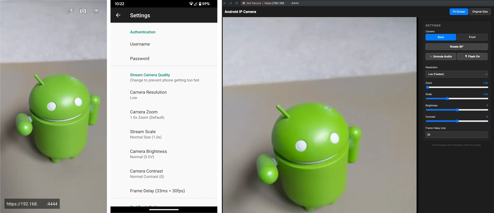

# Android IP Camera

An Android MJPEG IP Camera app

## Features

- 🌎 Built in server, just open the video stream in a web browser, video app or even set it as a Home Assistant MJPEG IP Camera (using `https://<ip_address>:4444/stream`)
- 📴 Option to turn the display off while streaming
- 🤳 Switch between the main or selfie camera
- 🎛️ Remote web interface with controls for camera section, image rotation, audio/video sync, flash light toggle, resolution, zoom, exposure and contrast
- 🖼️ Choose between different image quality settings and frame rates (to help reduce phone over heating)
- 🛂 Username and password protection
- 🔐 Automatic TLS certificate support to protect stream and login details via HTTPS

## ⚠️ Warning

If you are planning to run this 24/7, please make sure that your phone does not stay at 100% charge. Doing so may damage the battery and cause it to swell up, which could cause it to explode.

Some models include an option to only charge to 80%, make sure this is enabled where possible.

Note: running at a higher image quality may cause some phones to over heat, which can also damage the battery.

## HTTPS/TLS certificates

To protect the stream and the password from being sent in plain-text over HTTP, a certificate can be used to start the stream over HTTPS.

The app will automatically generate a self-signed certificate on first launch, but if you have your own domain you can use [Let's Encrypt](https://letsencrypt.org) to generate a trusted certificate and skip the self-signed security warning message, by changing the TLS certificate in the settings.

To generate a new self-signed certificate, clear the app settings and restart or clone this repo and run `./scripts/generate-certificate.sh` then use the certificate `personal_certificate.p12` file it generates.
