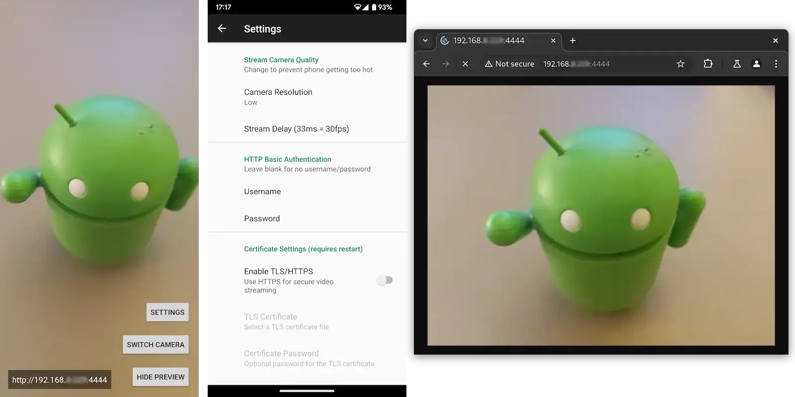

# Android IP Camera 🔒

[](https://github.com/DigitallyRefined/android-ip-camera/releases)
[](https://github.com/DigitallyRefined/android-ip-camera/releases)
[](https://opensource.org/licenses/MIT)
[](https://developer.android.com/distribute/best-practices/develop/target-sdk)
[](https://kotlinlang.org/)

**Secure Android MJPEG IP Camera with mandatory authentication and HTTPS encryption**



Transform your Android phone into a secure IP camera with enterprise-grade security features. No unauthenticated access allowed - your privacy is protected by design.

## 📋 Table of Contents

- [🚀 Quick Start](#-quick-start)
- [📱 Features](#-features)
- [🔒 Security Overview](#-security-overview)
- [⚠️ Critical Warnings](#️-critical-warnings)
- [🛠️ Installation](#️-installation)
- [⚙️ Configuration](#️-configuration)
- [🏗️ Development Setup](#️-development-setup)
- [📚 Documentation](#-documentation)
- [🤝 Contributing](#-contributing)
- [📄 License](#-license)

## 🚀 Quick Start

### For End Users

1. **Download** APK from [Releases](https://github.com/DigitallyRefined/android-ip-camera/releases)
2. **Install** on Android phone (API 24+)
3. **Configure Security**:
   - Open app → Settings
   - Set strong username/password (required)
   - Set certificate password
4. **Connect**: `https://[PHONE_IP]:4444`
5. **Login** with your credentials

**⚠️ No default credentials - you MUST configure your own!**

### For Developers

```cmd
# Complete setup in one command
build-setup.bat

# Build the APK
build.bat

# APK location: app\build\outputs\apk\debug\app-debug.apk
```

## 📱 Features

### Core Functionality
- 🌐 **Built-in HTTPS Server** - Secure MJPEG streaming
- 📱 **Mobile-Optimized** - Works with any Android device
- 🎥 **Dual Camera Support** - Front and rear camera switching
- 📊 **Quality Control** - Multiple resolution and frame rate options
- 🔄 **Real-time Streaming** - Low-latency video feed
- 🏠 **Home Assistant Compatible** - MJPEG IP camera integration

### Security Features (MANDATORY)
- 🔒 **Mandatory Authentication** - No unauthenticated access allowed
- 🔐 **Mandatory HTTPS** - TLS 1.3 encryption only
- 🛡️ **Hardware-Backed Encryption** - Android Security Library
- 🚦 **Rate Limiting** - Brute force protection
- ⏱️ **Connection Limits** - Automatic session cleanup
- ✅ **Input Validation** - XSS and injection protection

### Advanced Features
- 📹 **Digital Zoom** - 0.5x to 2.0x optical zoom
- 📐 **Stream Scaling** - Dynamic resolution scaling
- 🌙 **Display Control** - Auto screen off during streaming
- ⚡ **Performance Optimized** - Efficient image processing
- 🔧 **Real-time Settings** - Dynamic configuration updates

## 🔒 Security Overview

### Security Architecture
- **Zero-Trust Design** - Authentication required for ALL connections
- **End-to-End Encryption** - TLS 1.3 with strong cipher suites
- **Hardware Security** - Android Keystore for credential storage
- **Rate Limiting** - 3-attempt limit with 1-hour blocks
- **Input Sanitization** - Comprehensive validation and filtering
- **Certificate Management** - Encrypted PKCS12 certificates

### Security Controls
| Security Layer | Implementation | Status |
|---|---|---|
| **Authentication** | Mandatory username/password | ✅ Enforced |
| **Encryption** | TLS 1.3 only | ✅ Enforced |
| **Data Protection** | Hardware-backed encryption | ✅ Active |
| **Rate Limiting** | IP-based blocking | ✅ Active |
| **Input Validation** | XSS/injection protection | ✅ Active |
| **Session Management** | 30-minute timeouts | ✅ Active |

## ⚠️ Critical Warnings

### 🚨 SECURITY WARNING

**DO NOT expose this app to the public internet without proper network security!**

**Risks of misconfiguration:**
- ❌ Complete camera access by unauthorized parties
- ❌ Live video surveillance without consent
- ❌ Potential criminal activity (burglary targeting)
- ❌ Privacy violations and legal liability

**Required security measures:**
- ✅ Keep within local network only
- ✅ Use firewall restrictions
- ✅ Strong, unique credentials
- ✅ Regular certificate rotation

### 🔋 HARDWARE WARNING

**24/7 usage may damage your device:**
- Battery degradation at 100% charge
- Overheating with high quality settings
- Hardware stress from continuous operation

**Recommendations:**
- Limit to 80% charge maximum
- Use lowest quality for long sessions
- Monitor device temperature
- Allow cooling periods

## 🛠️ Installation

### Option 1: Pre-built APK (Recommended)

<div align="center">
<a href="https://github.com/DigitallyRefined/android-ip-camera/releases">
</a>

<a href="https://github.com/ImranR98/Obtainium">
</a>
</div>

### Option 2: Build from Source

#### Prerequisites
- **Java JDK 11+** ([Adoptium](https://adoptium.net/temurin/releases/))
- **Android Studio** ([Download](https://developer.android.com/studio))
- **OpenSSL** (for certificate generation)

#### Automated Build
```cmd
# One-time environment setup
build-setup.bat

# Fix Java environment (if needed)
fix-java.bat

# Build APK
build.bat
```

#### Manual Build
```cmd
# Generate certificate
setup.bat

# Build with Gradle
./gradlew.bat assembleDebug
```

## ⚙️ Configuration

### Required Setup Steps

1. **Install APK** on Android device
2. **Open App** → **Settings**
3. **Configure Authentication**:
   - Username: `[your-username]`
   - Password: `[strong-password]`
4. **Set Certificate Password** (from setup.bat)
5. **Test Connection**: `https://[IP]:4444`

### Advanced Configuration

#### Camera Settings
- **Resolution**: Low/Medium/High quality options
- **Zoom**: 0.5x - 2.0x digital zoom
- **Frame Rate**: 10-30 FPS (adjust for performance)
- **Scaling**: 0.5x - 2.0x stream scaling

#### Security Settings
- **Custom Certificates**: Upload your own `.p12` files
- **Certificate Testing**: Built-in validation tools
- **Rate Limit Tuning**: Advanced security options

## 🏗️ Development Setup

### Environment Setup

#### Windows (Automated)
```cmd
# Complete setup
build-setup.bat

# Fix Java issues
fix-java.bat
```

#### Windows (Manual)
```cmd
# Install prerequisites
# 1. Java JDK 11+ from Adoptium
# 2. Android Studio with SDK
# 3. OpenSSL for certificates

# Set environment variables
set JAVA_HOME=C:\path\to\jdk
set ANDROID_HOME=C:\Users\%USERNAME%\AppData\Local\Android\Sdk

# Generate certificate
setup.bat

# Build
./gradlew.bat assembleDebug
```

### Certificate Options

#### Personal Use (Recommended)
```cmd
scripts/setup-personal.bat
# Interactive password setup
```

#### Development
```cmd
setup.bat
# Uses known password: camera2024
```

#### Testing
```cmd
scripts/generate-dev-certificate.bat
# Uses dev password: devcamera123
```

### Project Structure
```
android-ip-camera/
├── app/                          # Main application
│   ├── src/main/
│   │   ├── AndroidManifest.xml
│   │   ├── assets/              # Certificate storage
│   │   └── kotlin/com/github/digitallyrefined/androidipcamera/
│   │       ├── activities/      # UI activities
│   │       └── helpers/         # Core functionality
│   └── build.gradle            # App configuration
├── scripts/                     # Build and setup scripts
├── build.gradle                # Project configuration
├── build-setup.bat             # Environment setup
├── build.bat                   # Quick build
├── setup.bat                   # Certificate generation
└── README.md
```

## 📚 Documentation

### User Guides
- [Quick Start Guide](docs/quick-start.md)
- [Security Configuration](docs/security-setup.md)
- [Troubleshooting](docs/troubleshooting.md)

### Developer Documentation
- [API Reference](docs/api-reference.md)
- [Security Architecture](SECURITY_UPGRADES.md)
- [Build System](docs/build-system.md)
- [Contributing Guidelines](CONTRIBUTING.md)

### Security Documentation
- [SECURITY_UPGRADES.md](SECURITY_UPGRADES.md) - Complete security improvements
- [Threat Model](docs/threat-model.md)
- [Security Best Practices](docs/security-best-practices.md)

## 🤝 Contributing

We welcome contributions! Please see our [Contributing Guidelines](CONTRIBUTING.md).

### Development Workflow
1. Fork the repository
2. Create a feature branch
3. Make your changes
4. Run tests and security checks
5. Submit a pull request

### Security Considerations
- All changes must maintain security requirements
- Authentication bypasses are critical vulnerabilities
- HTTPS-only policy must be preserved
- Input validation must be comprehensive

### Testing
```cmd
# Run unit tests
./gradlew.bat test

# Run security tests
./gradlew.bat securityCheck

# Build and test APK
build.bat
```

## 📄 License

This project is licensed under the MIT License - see the [LICENSE](LICENSE) file for details.

### Permissions
- **Camera**: Required for video capture
- **Internet**: Required for streaming server
- **Storage**: Required for certificate management

## 🙏 Acknowledgments

- Android CameraX for camera functionality
- AndroidX Security for encryption
- Kotlin Coroutines for async operations
- OpenSSL for certificate generation

## 📞 Support

### Issues & Bug Reports
- [GitHub Issues](https://github.com/DigitallyRefined/android-ip-camera/issues)
- Security issues: security@digitallyrefined.com

### Community
- [Discussions](https://github.com/DigitallyRefined/android-ip-camera/discussions)
- [Wiki](https://github.com/DigitallyRefined/android-ip-camera/wiki)

---

**🔒 Security First**: This app is designed with security as the highest priority. All connections require authentication and use HTTPS encryption. Never expose to public networks without proper security measures.